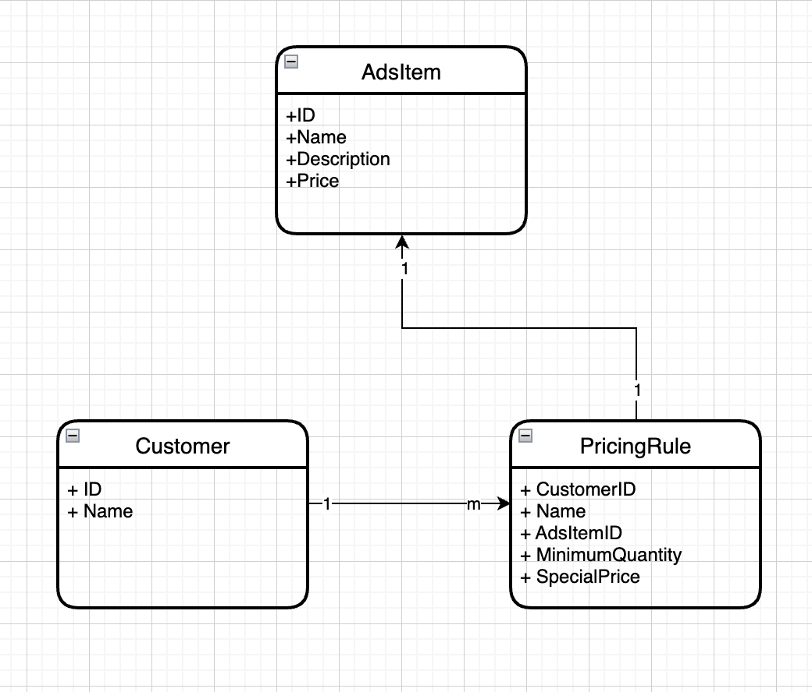

# SEEK

1. [ Requirements and Assumptions ](#requirements)
2. [ Getting Started ](#getting-started)

<a name="requirements"></a>
## Requirements and Assumptions

### Requirements
1. Write SEEK job ads checkout system
2. Privilaged customer has pricing rules for a certain items
3. Pricing rule is frequently negotiated built a system where it is easy to change the pricing rule for a given customer
4. Develop either backend or frontend system

### Assumptions
1. For this demo we will focus on developing total price functionality for given ads items
2. We will built API called `POST /checkout/totalprice` which can be use by frontend (Web, Mobile, etc) to calculate total price of all items in the cart
3. For a given customer no overlapping rules for the same item. For example BHP customer should not have the following pricing rules
    - Gets a 3 for 2 deal on Classic Ads
    - Special discount on Classic Ads $200
4. Pricing rule apply to a single item not multiple items. The following is not possible:
    - Gets 3 Classic and 2 Stand Outs Ads for $1000

### Entity Design




<a name="getting-started"></a>
## Getting Started

### Pre-requisite
1. GoLang version 1.18+
2. Docker 

### Running as Binary
1. To run this application you need to install go 1.18
2. Execute `go install` in your terminal to download all dependenc
3. To run as standalone you can run `go run .`
4. Or you can build the binary by executing `go build -o app` and this will generate `app` binary (it will be app.exe if you run this in windows)
5. Then you can execute the binary `./app`

### Running as Docker

1. Build the docker image using multistage build  
`docker build -f Dockerfile.multistage -t seek-checkout:latest .`

2. Run docker image `docker run -p 8080:8080 seek-checkout`

### Sample Run

1. After successfully running the service go to `http://localhost:8080/swaggerui/#/Checkout/post_checkout_totalprice`
2. Click 'Try it out'
3. Enter customerid in the parameters. Ideally this should be an authenticated session but for simplicity we are just going to set the customerid in the header directly
4. The following are the configuration for the items:
    - Id "1" => Classic Ad
    - Id "2" => Stand out Ad
    - Id "3" => Premium Ad
5. The following are the configuration for the customer:
    - "2" => SecondBine
    - "3" => Axil Coffee Roasters
    - "4" => MYER
6. The request body already has necessary payload or you can set it yourself too.
7. Click Execute
8. If you have set customerid as "1" you would get
```
{
  "totalPrice": "1797.94"
}
```